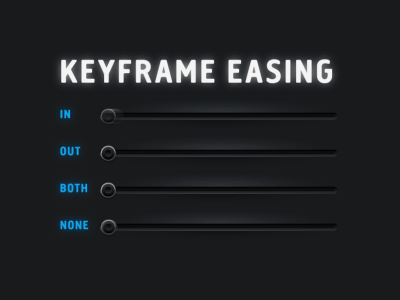

autoscale: true
build-lists: true


# [fit]UIViewAnimation

# [fit]What is an Animation?
- An attribute that changes gradually over time.
- Eg. Animate the change of position of some element.
- Eg. Animate some color change.
- Why is animate important?

# [fit]4 Animation APIs
### Core Animation (cross platform)
### UIViewAnimation (begin & commit)
### UIViewAnimation with Blocks
### UIViewPropertyAnimator (iOS/tvOS 10+)

# [fit]When To Use What
- Use Core Animation for low level control and/or cross platform.
- Use UIViewAimation (begin & commit) to run an animation x number of times.
- Use UIView block animations if you need simple animations, repeating animations, autoreversing animations, and transition animations.
- Use UIViewPropertyAnimator if you need control over timing functions, multiple completion handlers, ability to pause, resume, reverse and interact.
- Today I will just be covering UIView Block animations.

# [fit]What Happens With Animation
- Animation is an optical illusion.
- It's like an old fashioned cartoon.
- Changes are made in discrete "frames" that are redrawn using the screen's rapid redraw cycle.
- These changes are too gradual and too quick for human perception which perceives the result as a smooth change over time.
- Animation is handled using what Apple calls an "Animation Server".

# [fit]Presentation Layer
- Animation is not using the actual elements of the display.
- Instead animation uses a special presentation layer (analogous to a movie) over top of the real view.
- When the animation is finished this layer is removed revealing the actual view again.
- Animations happen on a background thread.
- You will have to use completion handlers provided to get notified when animations are finished.

# [fit]Animatable Properties
- All animations are ultimately CALayer animations (Core Animation Layer).
- UIView is a wrapper around CALayer and exposes a subset of the layer's animatable attributes.
- alpha, bounds, center, frame, transform, and backgroundColor (if it doesn't implement `draw(:)`)
- iOS 11 adds the ability to animate the layer's corner radius.
- You can also animate changing the contents of a view.
- CALayer has many more animatable properties. [Link](https://developer.apple.com/library/archive/documentation/Cocoa/Conceptual/CoreAnimation_guide/AnimatableProperties/AnimatableProperties.html)
- Check the documentation.

# [fit]Simple UIView Animation

```swift
class func animate(withDuration duration: TimeInterval, animations: @escaping () -> Void)

UIView.animate(withDuration: 1.0) {
}

```

# [fit]Simple UIView Animation

### Values inside the block define the end-states of the animation.

```swift

label.alpha = 1.0;
UIView.animate(withDuration: 1.0) {
  label.alpha = 0.0;
}
```

# [fit]UIView Animations /w Options, Completion

```swift

class func animate(withDuration duration: TimeInterval, 
delay: TimeInterval, 
options: UIViewAnimationOptions = [], 
animations: @escaping () -> Void, 
completion: ((Bool) -> Void)? = nil)

```

# [fit]Calling UIView Animation /w Options, Completion

```swift

label.alpha = 1.0;

UIView.animate(withDuration: 1.0, 
delay: 0, 
options: [.repeat, .autoreverse, .curveEaseIn], 
animations:{
  label.alpha = 0
}, completion: { complete in
  // do completion stuff
})

```

# [fit]Animation Options 

.repeat
.autoreverse
.linear
.curveEaseIn
.curveEaseOut
.curveEaseInOut


---



# [fit]UIView Spring Animation

```swift

class func animate(withDuration: TimeInterval, 
  delay: TimeInterval, 
  usingSpringWithDamping: CGFloat, 
  initialSpringVelocity: CGFloat, 
  options: UIViewAnimationOptions = [], 
  animations: () -> Void, 
  completion: ((Bool) -> Void)? = nil)

```

# [fit]Calling Spring Animation

```swift

UIView.animate(withDuration: 1.0, 
  delay: 0,
  usingSpringWithDamping: 0.5,
  initialSpringVelocity: 0.5,
    animations: {
      label.alpha = 0;
},
      completion: {completed in
      // do stuff          
})

```

# [fit]UIView Keyframe Animations

* Keyframe animations are used when you want to time a group of animations relative to each other.
* Create a keyframe animation block, then add keyframes inside the block. 

---

```swift

class func animateKeyframes(withDuration duration: TimeInterval, 
  delay: TimeInterval, 
  options: UIViewKeyframeAnimationOptions = [], 
  animations: @escaping () -> Void, 
  completion: ((Bool) -> Void)? = nil)

```

---

* Add animations inside the animation block using this UIView Class method:

```swift
class func addKeyframe(withRelativeStartTime frameStartTime: Double, 
  relativeDuration frameDuration: Double, 
  animations: @escaping () -> Void)
  
```

# [fit]Keyframe Animations Example

```swift

@objc func animateKeyFrames() {
    UIView.animateKeyframes(withDuration: 2.0, delay: 0, animations: {
      UIView.addKeyframe(withRelativeStartTime: 0, relativeDuration: 0.25, animations: {
        self.button.transform = CGAffineTransform(rotationAngle: 0.5*CGFloat.pi)
      })
      UIView.addKeyframe(withRelativeStartTime: 0.25, relativeDuration: 0.25, animations: {
        self.button.transform = CGAffineTransform(rotationAngle: CGFloat.pi)
      })
      UIView.addKeyframe(withRelativeStartTime: 0.5, relativeDuration: 0.25, animations: {
        self.button.transform = CGAffineTransform(rotationAngle: 1.5*CGFloat.pi)
      })
      UIView.addKeyframe(withRelativeStartTime: 0.75, relativeDuration: 0.25, animations: {
        self.button.transform = CGAffineTransform(rotationAngle: 2*CGFloat.pi)
      })
    })
  }


```

# [fit]UIView Transitions

Animate the addition or removal of a view

.transitionFlipFromLeft 
.transitionFlipFromRight 
.transitionCurlUp 
.transitionCurlDown 
.transitionCrossDissolve 
.transitionFlipFromTop 
.transitionFlipFromBottom 

# [fit]Autolayout & Frames

* Be careful mixing auto layout and manual layout if you intend to animate.
* 🎗If you plan on moving an object around & animating it, consider manual layout.  😫

# [fit]Autoloyout & Animations

* To work animate layouts you need outlets to constraints (if done in storyboard) or properties to constraints (if done programmatically).
* To animate a constraint you have to call `layoutIfNeeded` inside the animation block, since autolayout constants are not directly animatable.
* ☠️ calling `layoutIfNeeded` will apply animations to all constraint changes.
* To prevent animating some constraint changes call `layoutIfNeeded` immediately after setting them outside the animation block.

# [fit]Autoloyout & Animations

* The `constant` property is the only mutable property on the `NSLayoutConstraint` class.
* To modify the multiplier, or change a constraint in any other way,  remove or deactivate the constraint, then add a new one in its place.

# [fit]Demo


